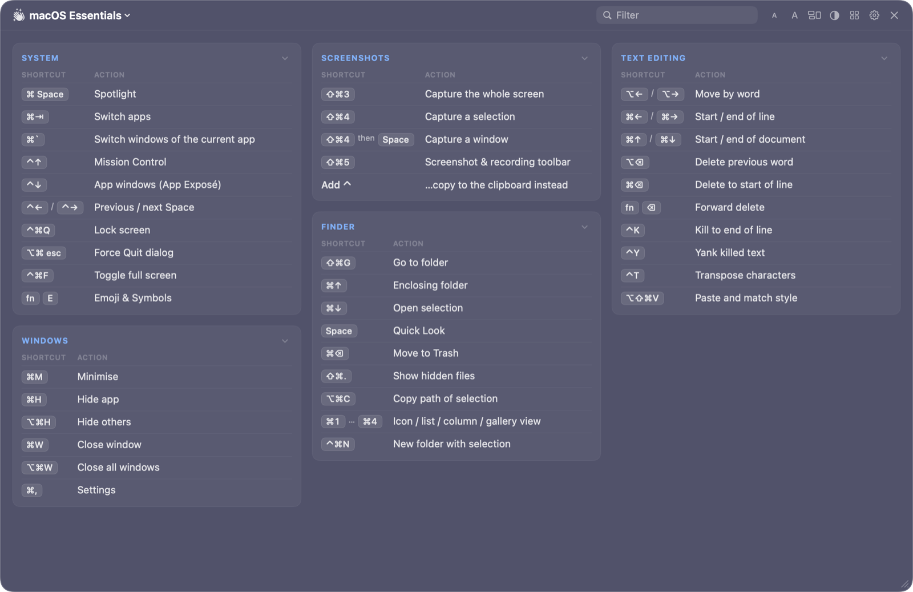
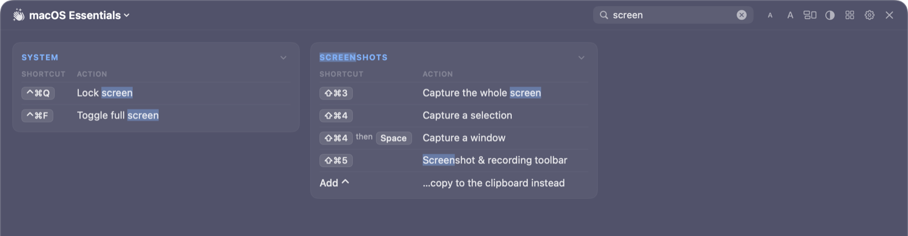
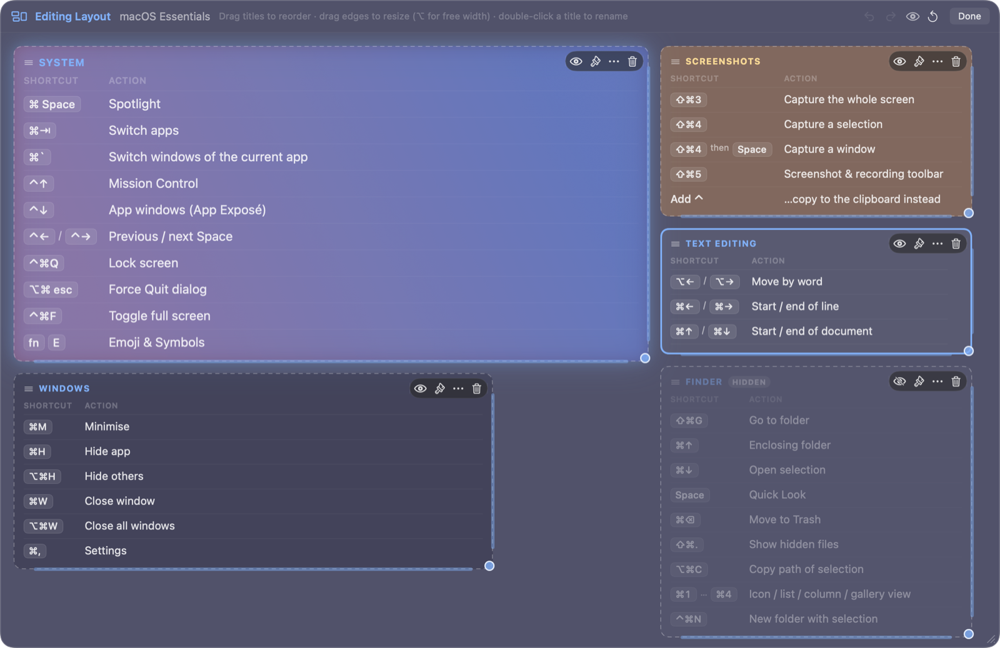
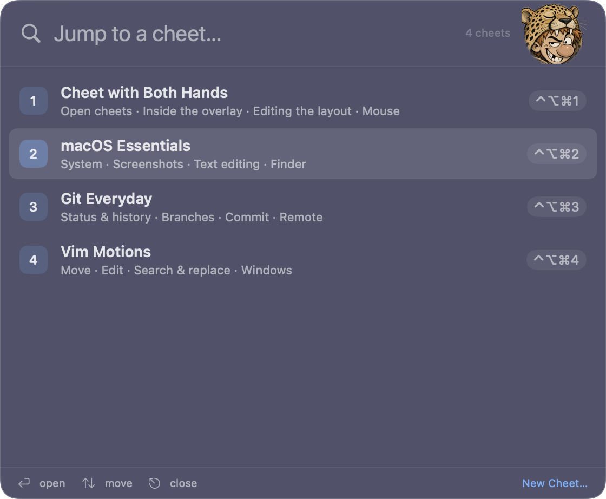

<p align="center">
  
</p>

<h1 align="center">Cheet with Both Hands</h1>

<p align="center"><b>Cheat sheets on a hotkey, for every app.</b><br>Brought to you by Cheeter, who keeps the good shortcuts scribbled up one arm.</p>

A menu-bar app for macOS that pops up **cheets** (cheat sheets) on a hotkey. It fades in a translucent,
interactive overlay over whatever you're working in. Tap the combo to pin a cheet, or hold it to
peek and let go to hide it.



## A quick tour

**Type to filter.** Matching rows stay and the rest drop away, across every card.



**Make it yours.** Drag cards to reorder, resize them to span columns, hide the ones you don't need,
and give each its own colors, gradient or glow.



**Jump anywhere.** ⌃⌥⌘/ opens the picker. Search every cheet and press Return. Cheeter keeps you company.

<p align="center">
  
</p>

## Download

Every push builds the app on GitHub Actions. Open a run under **Actions › Build** and download the
**Cheet-with-Both-Hands** artifact. Pushing a version tag attaches the zip to that tag's release
under **Releases**, creating the release if you haven't made it yet:

```bash
git tag v1.1.0 && git push origin v1.1.0
```

For a release that has no zip yet, run **Actions › Build › Run workflow** and enter its tag. That
builds the tagged code and attaches the zip.

The app is ad-hoc signed, not notarized, so macOS blocks it the first time. Unzip it, move it to
Applications, open it, then allow it under System Settings › Privacy & Security › **Open Anyway**.

## Build & run

Requires macOS 14+ and a Swift 6 toolchain: Xcode 16+, or just the Command Line Tools. Tests use
Swift Testing, so they run without Xcode too.

```bash
make app        # builds "build/Cheet with Both Hands.app" (release, ad-hoc signed)
make run        # build + launch
make install    # copy to /Applications
make test       # parser / resolver / storage tests
make dist       # universal (arm64 + x86_64) app, zipped to build/Cheet-with-Both-Hands.zip
```

`UNIVERSAL=1 make app` builds an arm64 + x86_64 binary. `VERSION=1.2.0 BUILD_NUMBER=42` stamps the
bundle's version (CI does this for tags).

## Using it

| Default shortcut | Does |
|---|---|
| ⌃⌥⌘1 … ⌃⌥⌘9, ⌃⌥⌘0 | Show cheet 1–10 (position in the library) |
| ⌃⌥⌘/ | Cheet picker (search every cheet) |
| ⌃⌥⌘` | Toggle the last cheet |

Inside the overlay: type to filter, ↑↓ scroll (⌥↑↓ / Page Up·Down / Space by the page, ⌘↑↓ to
the ends — even while the filter field has focus), Esc clears then closes, ⌘[ / ⌘] switch cheets, ⌘1–9 jump,
⌘+ / ⌘- / ⌘0 change the text size, ⌘P opens the picker, ⌘E edits the layout, ⌥⌘E edits the
content. Click a cell to copy it. Drag the header to move, drag the corner to resize, and double-click the header to snap back to
the preset position. Click a section title to collapse it.

### Editing the layout

Press ⌘E (or the layout button in the header) to edit the layout. Every section is a card that
you can:

- **reorder** by dragging its title. The other cards flow around each card's actual width and
  height.
- **resize** from the right edge, the bottom edge or the corner. Width snaps to whole columns (hold
  ⌥ for free-form), and height is either fixed (content scrolls inside) or fit-to-content.
  Double-clicking a handle resets it.
- **hide**, which keeps the card but doesn't show it, **delete** it, or **rename** it by
  double-clicking its title.
- **style** it with its own text size, title and text colors, a background (default, none, solid,
  gradient or frosted glass) with opacity, an effect (glow, shadow or outline) and a corner radius.
  "Apply to All Cards" copies one card's style to the rest.

⌘Z / ⇧⌘Z undo and redo. Selecting a card and pressing H hides it, and ⌫ deletes it. The layout is
stored with the cheet, and it survives edits to the content (cards are matched by title).

The **menu bar icon** lists every cheet with its shortcut. It also has New Cheet, New Cheet from
Clipboard, Import Files, Ghost Mode (click-through), pause hotkeys, Launch at Login and Settings.

### Settings

- **General**: launch at login, trigger behavior, and the icon style. **Cheeter** (the default) is the
  mascot: Cheeter as the app icon, the ⌘ war hammer in the menu bar, an optional splash screen at launch
  (it shows for at least half a second and until the app is ready), and an optional cameo in the cheet
  picker. **Classic** swaps in the original keycap icons in the Dock, ⌘-Tab and menu bar. The Finder
  icon is always Cheeter.
- **Hotkeys**: the base combo for number shortcuts (any mix of ⌃⌥⇧⌘), global action combos, and
  per-cheet Automatic / Custom / None with conflict and availability badges.
- **Appearance**: blur material, light/dark, tint color and strength, background and window
  opacity, font family, design and size, text and accent colors, corner radius, columns, density,
  cards, row separators, keycap style (⌘⇧P vs Cmd+Shift+P). Any cheet can override the global look.
- **Position & Size**: 9-point anchor, width/height, margin, which screen. Moves and resizes are
  remembered, either globally or per cheet.
- **Cheets**: drag to reorder (this renumbers the automatic shortcuts), rename, edit, duplicate,
  export (Markdown / JSON) or delete.

## Making cheets

**New Cheet…** opens an import window with a live preview. You can paste text, drop a file, open
one, or fetch a URL. The format is auto-detected:

| Input | What becomes what |
|---|---|
| **Markdown** | `#` title, `##` cards, `###` sub-headings; GFM tables, lists, code blocks. Lists like ``- `key` — description`` become tables. |
| **HTML** | Headings, tables (including group rows and `<thead>`), `ul`/`ol`, `dl` definition lists, `pre`. `<kbd>`/`<code>`/`<b>`/links are kept. Nav, footer, scripts and styles are stripped. Rich HTML from the clipboard is used when you copy from a browser. |
| **CSV / TSV / aligned columns** | Header row is detected. A single-cell row starts a new section. A leading `Category`/`Section`/`Group` column groups rows into cards. |
| **JSON** | Arrays of objects or arrays become tables, objects become key/value tables or sections. The app's own cheet export also imports. |

### From the web

**Import from URL…** (⇧⌘U) fetches a page and lists what it found (sections, tables, lists, code,
text) as elements you can tick or untick, with a live preview. It pre-unticks page chrome such as
link-only navigation lists, cookie banners, and "Related posts" or "Comments" sections. Generic pages
can be read from their main content only or in full, and Markdown, CSV and JSON URLs work too.
Re-importing a page updates the existing cheet and keeps its layout. A browser bookmarklet (copy it
from the empty Import from URL window) sends whatever page you're viewing to the app.

**Browse Cheatography…** (⇧⌘B) is a catalog browser for [cheatography.com](https://cheatography.com).
It has search, the Newest / Popular / Top Rated / Most Downloaded feeds, categories and tags, with
thumbnails, ratings and pagination. **Import…** opens a cheet in the element picker, and ticking
several and choosing **Import N Selected** brings them all in (fetched one at a time, politely).
Cheatography pages get a dedicated reader that understands its block types: key/value tables,
side-by-side pairs, lists, free text, code and notes. Each import keeps its author credit and
source link, shown under Settings › Cheets.

### Formulas and images

Math is imported as text, not pictures, so it stays sharp, searchable and copyable. The sources
covered are HTML `<sup>`/`<sub>`, MathML (Wikipedia, KaTeX), MathJax `math/tex` scripts, raw LaTeX in
pages that typeset it with JavaScript (`\( \)`, `\[ \]`, `$$ $$`, and `$ $` on MathJax/KaTeX pages),
and formula images whose alt text is LaTeX (codecogs and similar). A LaTeX converter handles Greek,
operators and relations, `\frac`, `\sqrt`, accents, `\mathbb`/`\mathcal`, matrices and cases.
Scripts use Unicode where it's reliable (x², H₂O). Otherwise the overlay draws them raised or lowered
(Σ^∞ₙ₌₀), stored as Apple's Markdown extension `^[n=0](script: -1)`. Copying a cell gives plain
Unicode text.

Images come in as image blocks: standalone images, figures with their captions, and Cheatography
image blocks. Images inside table cells stay inline. Lazy-loaded sources and `srcset` are handled,
and spacers, tracking pixels, hidden decorations and citation markers are skipped. Images are
downloaded once into the library's `images/` folder (embedded `data:` images too) so cheets work
offline. Click one to copy it, or right-click to open the original. A light backdrop keeps dark
diagrams legible on dark overlays (Appearance), and "Include images when importing web pages" turns
image imports off (General).

Cells that look like shortcuts (`Ctrl+Shift+P`, `⌘K ⌘S`, `C-x C-s`, `<kbd>` sequences) are drawn as
keycaps.

## Automation

```bash
open "cheetwithbothhands://show/2"       # by position…
open "cheetwithbothhands://toggle/git"   # …or by title
open "cheetwithbothhands://picker"
open "cheetwithbothhands://hide"
open "cheetwithbothhands://ghost"
open "cheetwithbothhands://import"       # new cheet from the clipboard
open "cheetwithbothhands://import-url?url=https%3A%2F%2Fexample.com%2Fkeys"
open "cheetwithbothhands://browse?q=vim"  # search Cheatography
```

## Data

Everything is plain JSON in `~/Library/Application Support/Cheet with Both Hands/`:
`library.json` (cheets, in order), `images/` (cached images), `settings.json`, and `state.json` (last cheet, remembered
positions, collapsed sections). A `library.backup.json` copy is taken at every launch. Data from before the rename
(`…/Cheat with Both Hands/`) is moved over automatically on first launch, and older files and exports
still load.
General › Export/Import Library moves the whole collection between Macs.

## Layout

```
Sources/CheetCore/            platform-light model + logic (unit tested)
  Models/                     Cheet, blocks, KeyCombo, settings (forward-compatible decoding)
  Import/                     Markdown, HTML, delimited, JSON importers → SectionBuilder
  Export/                     Markdown exporter (round-trips through the importer)
  Support/                    keycap detection, hotkey resolution, search index
  Storage/                    JSON persistence, sample cheets
Sources/CheetWithBothHands/   AppKit + SwiftUI app
  Hotkeys/                    Carbon RegisterEventHotKey (no Accessibility permission), recorder
  Overlay/                    non-activating NSPanel, fade/peek logic, masonry cheet renderer
  Picker/                     Spotlight-style cheet switcher
  MenuBar/  Settings/  Importer/
Resources/Cheeter/            mascot art: source.webp, plus the PNGs generated from it
scripts/                      build-app.sh, make-icon.swift, make-cheeter-assets.swift
```

Global hotkeys use Carbon's `RegisterEventHotKey`, which works without Accessibility permission
and reports key release (that's what powers hold-to-peek). The overlay is a non-activating panel,
so it can take keyboard focus for filtering without taking activation away from the app you're in.

Dev aid: `CWBH_DATA_DIR=/tmp/cwbh` runs the app against a scratch library, and adding
`CWBH_SNAPSHOT_DIR=/tmp/shots` renders every window to PNG and quits.

## License

MIT. See [LICENSE](LICENSE).
